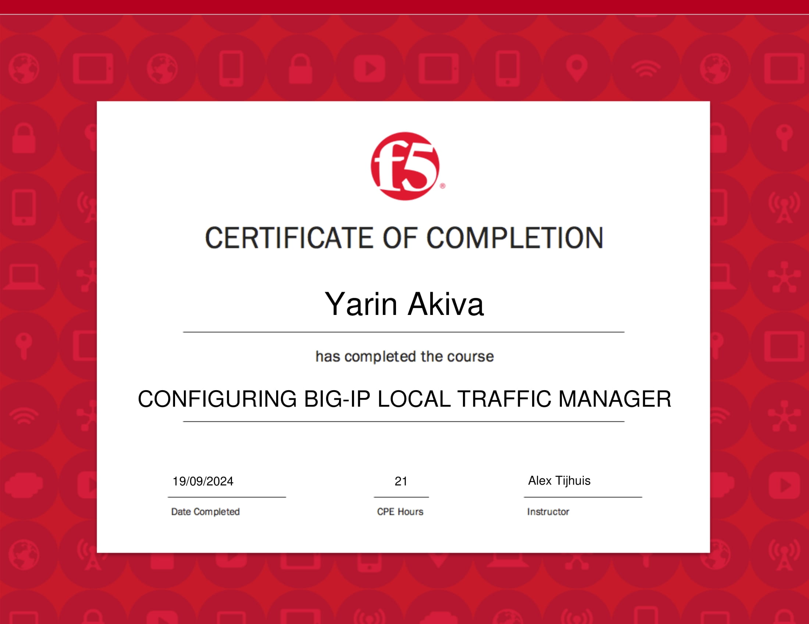
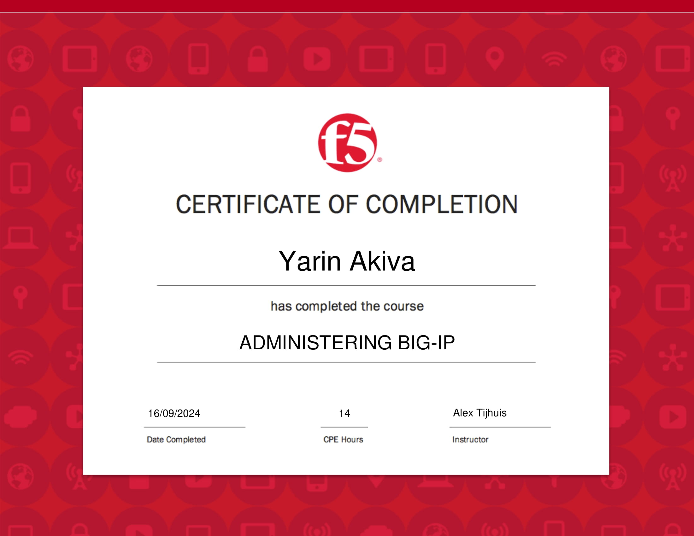

## Professional Certifications

    <!-- F5 LTM Certificate -->
    

        
        

            <h3 class="text-lg font-semibold">Configuring BIG-IP Local Traffic Manager</h3>
            
Completed: September 19, 2024

            
CPE Hours: 21

        

    

    
    <!-- F5 BIG-IP Certificate -->
    

        
        

            <h3 class="text-lg font-semibold">Administering BIG-IP</h3>
            
Completed: September 16, 2024

            
CPE Hours: 14

        

    

<!-- Modal for Certificates -->

    

        &times;
        
    

