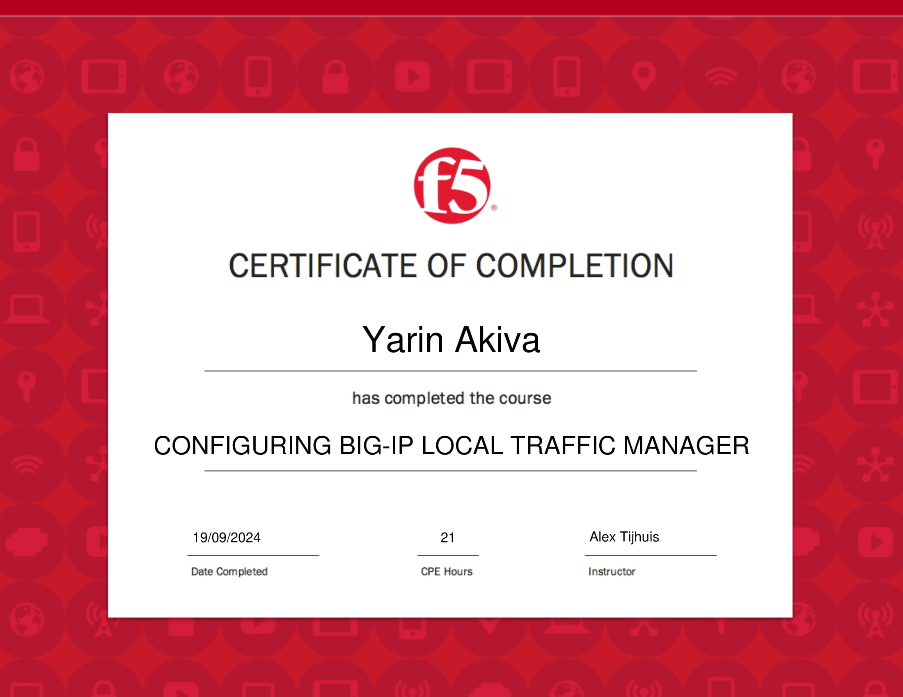
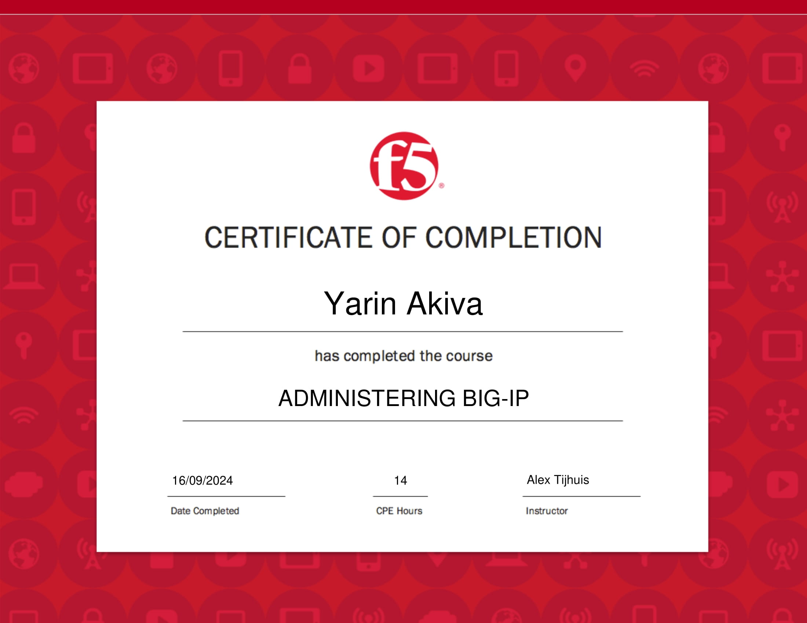

    <!-- Hero Section -->
    

        

            <h1 class="text-4xl md:text-5xl lg:text-6xl font-bold text-gray-900 mb-6">
                Yarin Akiva
            </h1>
            

                DevOps Engineer & Cloud Solutions Architect
            

            

                <a href="#about" class="bg-blue-600 hover:bg-blue-700 text-white px-6 py-3 rounded-lg font-medium transition-colors">
                    Learn More
                </a>
            

        

    

    <!-- About Section -->
    

        <h2 class="text-3xl font-bold text-center mb-8">About Me</h2>
        

            

                Hi! I'm Yarin, a DevOps and cloud engineer specializing in AWS infrastructure and F5 technologies. 
                With professional certifications in F5 BIG-IP and experience in cloud architecture, I focus on 
                building robust, scalable infrastructure solutions.
            

        

    

    <!-- Certificates Section -->
    

        

            <h2 class="text-3xl font-bold text-center mb-12">Professional Certifications</h2>
            

                <!-- F5 LTM Certificate -->
                

                    
                    

                        <h3 class="text-lg font-semibold">Configuring BIG-IP Local Traffic Manager</h3>
                        
Completed: September 19, 2024

                        
CPE Hours: 21

                    

                

                
                <!-- F5 BIG-IP Certificate -->
                

                    
                    

                        <h3 class="text-lg font-semibold">Administering BIG-IP</h3>
                        
Completed: September 16, 2024

                        
CPE Hours: 14

                    

                

            

        

    

    <!-- Projects Section -->
    

        

            <h2 class="text-3xl font-bold text-center mb-12">Featured Projects</h2>
            

                

                    <h3 class="text-xl font-semibold mb-4">Static Website on AWS</h3>
                    

                        Implemented a static website using AWS S3, CloudFront, and Route 53 with SSL/TLS security.
                    

                    

                        AWS
                        S3
                        CloudFront
                    

                

            

        

    

    <!-- Contact Section -->
    

        

            <h2 class="text-3xl font-bold mb-8">Get in Touch</h2>
            

                Interested in collaborating or discussing opportunities?
            

            <a 
                href="mailto:yarin3db@gmail.com" 
                class="bg-blue-600 text-white px-8 py-3 rounded-lg font-medium hover:bg-blue-700 transition-colors inline-block"
            >
                Contact Me
            </a>
        

    

    <!-- Modal for Certificates -->
    

        

            <button 
                onclick="closeModal()" 
                class="close-modal absolute -top-10 right-0 text-white text-3xl hover:text-gray-300 transition-colors duration-200"
                aria-label="Close modal"
            >&times;</button>
            
        

    

<footer class="bg-gray-900 text-gray-400 py-8 text-center">
    
&copy; 2024 Yarin Akiva. All rights reserved.

</footer>